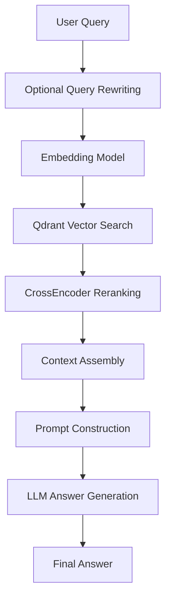

# RAG Academic QA System

<p align="center">
  
  
  
  
</p>

<p align="center">
  A retrieval-augmented generation system for grounded academic question answering over AI, ML, and Intelligent Systems course materials.
</p>

---

## Overview

**RAG Academic QA System** is an academic question-answering platform that retrieves relevant passages from a curated knowledge base of PDFs and lecture slides, then uses a large language model to generate grounded answers.

The system is designed to reduce hallucination by combining:

- **Dense retrieval** with semantic embeddings
- **Cross-encoder reranking** for precision
- **Prompt grounding** with retrieved context
- **Conversation memory** for multi-turn Q&A

It also includes an **experimental video generation module** that converts generated answers into short educational video clips.

---

## Key Features

- Upload and index academic PDFs and lecture materials
- Chunk documents into overlapping passages for better retrieval
- Store embeddings in **Qdrant**
- Retrieve candidates using semantic similarity search
- Rerank results using a **CrossEncoder**
- Generate answers with **GPT-4o-mini via OpenRouter**
- Support multi-turn conversations
- Built with a **Streamlit** web interface and CLI
- Experimental multimodal video generation pipeline

---

## Architecture



---

## Technology Stack

| Component | Technology |
|---|---|
| Core Language | Python 3.13 |
| Vector Database | Qdrant |
| Embeddings | BAAI/bge-small-en |
| Reranker | BAAI/bge-reranker-base |
| LLM | GPT-4o-mini via OpenRouter |
| PDF Parsing | PyMuPDF (fitz) |
| Web UI | Streamlit |
| Video Module | Hugging Face Spaces / Gradio client |
| Image Generation | Stable Diffusion 2 via HF Inference API |

---

## Knowledge Base

The knowledge base is built from **18 academic PDF documents** covering:

- Machine Learning textbooks
- Artificial Intelligence textbooks
- Intelligent Systems lecture slides
- Speech, NLP, and Genetic Algorithms materials
- Data mining and expert systems references

---

## Project Structure

```text
.
├── app.py
├── main.py
├── ingestion/
├── retrieval/
├── llm/
├── video/
├── guardrails/
├── services/
└── utils/
```

---

## How It Works

### 1) Ingestion
PDFs are extracted, cleaned, and split into overlapping chunks.

### 2) Embedding
Each chunk is converted into a dense vector representation.

### 3) Retrieval
The query is embedded and searched against Qdrant to find candidate passages.

### 4) Reranking
A CrossEncoder reranks the retrieved passages to improve relevance.

### 5) Answer Generation
The top passages are injected into a prompt and passed to the LLM to generate a grounded answer.

---

## Setup

### Prerequisites
- Python 3.13
- Git
- A running Qdrant instance
- OpenRouter API key

### Install dependencies

```bash
pip install -r requirements.txt
```

### Environment variables

Create a `.env` file and add your credentials:

```env
OPENROUTER_API_KEY=your_api_key
QDRANT_URL=http://localhost:6333
```

---

## Run the Project

### Streamlit app
```bash
streamlit run app.py
```

### CLI mode
```bash
python main.py
```

---

## Configuration Notes

- The system uses **local embeddings** and **local vector search** for privacy-sensitive retrieval.
- The LLM is accessed through **OpenRouter** for flexible model routing.
- The experimental video pipeline depends on external services and may require additional configuration.

---

## Strengths

- Strong grounding through retrieved context
- Efficient two-stage retrieval pipeline
- Lightweight local embedding and reranking
- Clear modular design
- Suitable for academic Q&A workflows

---

## Limitations

- The knowledge base is English-focused
- Scanned PDFs may require OCR for better extraction
- The video generation module is experimental
- Some guardrails are rule-based and can be improved further

---

## Future Improvements

- Hybrid retrieval with BM25 + dense search
- Fine-tuned domain embeddings
- OCR pipeline for scanned documents
- Knowledge graph integration
- Automated testing suite
- Docker-based deployment
- Stronger guardrails using intent classification

---

## Team

- **Mohamed El-Walid Mohamed**
- **Omar Ayman Abdelaziz**
- **Omar Amgad Abdelaziz**
- **Nayyera Badr Megahd**
- **Mahmoud Salah Abdelmoez**

---

## License

No license has been specified yet.
